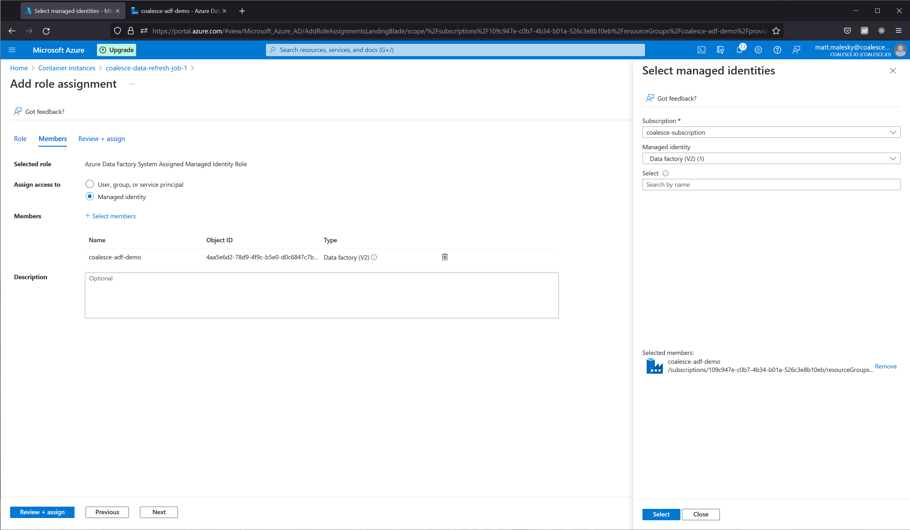

# Azure Data Factory Example

This example will use the `coalescesoftware/coa-container` [Docker Hub image](https://hub.docker.com/repository/docker/coalescesoftware/coa-container), with Azure Container Instances (ACI) to execute a `coa refresh` with provided parameters from Azure Data Factory via the ACI REST API.

# Create an Azure Container Instance

Create an Azure Container Instance. Select **Other Registry** in the **Image source** section and input `coalescesoftware/coa-container` in the **Image** field.


On the **Advanced** tab, **Restart policy** is set to **Never**. One environment variable named `ARGS` is created, and is set to the entire parameters string as if running `coa` from a regular terminal. This can be marked as secure and stored as a secret in ACI if desired.

As an example, the value for our `ARGS` variable will be `refresh --environmentID 2 --snowflakeAccount ww56777.region.gcp --snowflakeAuthType Basic --snowflakePassword S5eIzgxwn6 --snowflakeRole SYSADMIN --snowflakeUsername MATT --snowflakeWarehouse COMPUTE_WH --token S5eIzgxwn6S5eIzgxwn6S5eIzgxwn6S5eIzgxwn6S5eIzgxwn6S5eIzgxwn6 --jobID 1`. (Actual `token` value will be much longer).


After provisioning, you should immediately be able to see the container execution status with the provided parameters as either Succeeded or Failed based on the status code of the `coa` CLI running in the container.


Additionally, viewing the **Settings** > **Containers** page and then selecting **Logs** from the window will show the standard output of the `coa` command from the last execution.


# Create or amend an Azure Data Factory pipeline

The pipeline will follow the basic lifecycle of:
1. Start a refresh job via the Azure Container Instance created earlier.
2. Every 60s, poll the status of the Azure Container Instance until it is either `Succeeded` or `Failed`. This should accurately reflect the status of the `coa refresh` execution.
3. If the status has returned `Failed`, mark the pipeline execution as failed.

The basic overview of the pipeline is visible below, along with an example of the **Authentication** configuration for every API call set to **System Assigned Managed Identity** and **Resource** configured as `https://management.azure.com`.

The pipeline uses several **Web Activity**, **Until**, and **Switch** nodes to interact with the Azure Container Instance. The first interaction is to `POST` a start message to the Azure Container Instance API via the URL `https://management.azure.com/subscriptions/oGV2IfiB6yAlqOSgoGV2IfiB6yAlqOSg/resourceGroups/coalesce-adf-demo/providers/Microsoft.ContainerInstance/containerGroups/coalesce-data-refresh-job-1/start?api-version=2021-10-01`.


The full code (including example ACI API calls and pipeline logic) for the pipeline content is available below:

```
{
    "name": "pipeline1",
    "properties": {
        "activities": [
            {
                "name": "Start coa ACI jobID 1",
                "type": "WebActivity",
                "dependsOn": [],
                "policy": {
                    "timeout": "7.00:00:00",
                    "retry": 0,
                    "retryIntervalInSeconds": 30,
                    "secureOutput": false,
                    "secureInput": false
                },
                "userProperties": [],
                "typeProperties": {
                    "url": "https://management.azure.com/subscriptions/oGV2IfiB6yAlqOSgoGV2IfiB6yAlqOSg/resourceGroups/coalesce-adf-demo/providers/Microsoft.ContainerInstance/containerGroups/coalesce-data-refresh-job-1/start?api-version=2021-10-01",
                    "method": "POST",
                    "body": "\"\"",
                    "authentication": {
                        "type": "MSI",
                        "resource": "https://management.azure.com"
                    }
                }
            },
            {
                "name": "jobID 1 ACI state Succeeded or Failed",
                "type": "Until",
                "dependsOn": [
                    {
                        "activity": "Start coa ACI jobID 1",
                        "dependencyConditions": [
                            "Succeeded"
                        ]
                    }
                ],
                "userProperties": [],
                "typeProperties": {
                    "expression": {
                        "value": "@or(equals('Succeeded', activity('Poll ACI jobID 1 state').output.properties.instanceView.state), equals('Failed', activity('Poll ACI jobID 1 state').output.properties.instanceView.state))",
                        "type": "Expression"
                    },
                    "activities": [
                        {
                            "name": "Poll ACI jobID 1 state",
                            "type": "WebActivity",
                            "dependsOn": [
                                {
                                    "activity": "Wait 60s",
                                    "dependencyConditions": [
                                        "Succeeded"
                                    ]
                                }
                            ],
                            "policy": {
                                "timeout": "7.00:00:00",
                                "retry": 0,
                                "retryIntervalInSeconds": 30,
                                "secureOutput": false,
                                "secureInput": false
                            },
                            "userProperties": [],
                            "typeProperties": {
                                "url": "https://management.azure.com/subscriptions/oGV2IfiB6yAlqOSgoGV2IfiB6yAlqOSg/resourceGroups/coalesce-adf-demo/providers/Microsoft.ContainerInstance/containerGroups/coalesce-data-refresh-job-1?api-version=2021-10-01",
                                "method": "GET",
                                "authentication": {
                                    "type": "MSI",
                                    "resource": "https://management.azure.com"
                                }
                            }
                        },
                        {
                            "name": "Wait 60s",
                            "type": "Wait",
                            "dependsOn": [],
                            "userProperties": [],
                            "typeProperties": {
                                "waitTimeInSeconds": 60
                            }
                        }
                    ],
                    "timeout": "7.00:00:00"
                }
            },
            {
                "name": "ACI state",
                "type": "Switch",
                "dependsOn": [
                    {
                        "activity": "jobID 1 ACI state Succeeded or Failed",
                        "dependencyConditions": [
                            "Succeeded"
                        ]
                    }
                ],
                "userProperties": [],
                "typeProperties": {
                    "on": {
                        "value": "@activity('Poll ACI jobID 1 state').output.properties.instanceView.state",
                        "type": "Expression"
                    },
                    "cases": [
                        {
                            "value": "Failed",
                            "activities": [
                                {
                                    "name": "coa refresh failed",
                                    "type": "Fail",
                                    "dependsOn": [],
                                    "userProperties": [],
                                    "typeProperties": {
                                        "message": "coa refresh failed",
                                        "errorCode": "500"
                                    }
                                }
                            ]
                        }
                    ]
                }
            },
            {
                "name": "Visit google homepage",
                "type": "WebActivity",
                "dependsOn": [
                    {
                        "activity": "ACI state",
                        "dependencyConditions": [
                            "Succeeded"
                        ]
                    }
                ],
                "policy": {
                    "timeout": "7.00:00:00",
                    "retry": 0,
                    "retryIntervalInSeconds": 30,
                    "secureOutput": false,
                    "secureInput": false
                },
                "userProperties": [],
                "typeProperties": {
                    "url": "https://www.google.com",
                    "method": "GET"
                }
            }
        ],
        "annotations": [],
        "lastPublishTime": "2022-06-09T23:18:13Z"
    },
    "type": "Microsoft.DataFactory/factories/pipelines"
}
```

After creating the pipeline, access still needs to be provisioned before Azure Data Factory can start and manage the Azure Container Instance. This is outlined next.

# Set up IAM for Azure Data Factory to use the Azure Container Instance REST API

Next, navigate to the **Access Control (IAM)** page from your Azure Container Instance, select **Roles** and after clicking the ellipses menu on one of the roles, select **Clone** to create a new role.


On the role creation page, give the role a name. `Azure Data Factory System Assigned Managed Identity Role` has been used here. In the **Baseline permissions** radio toggle, select **Start from scratch**.


On the permissions page, select the **Add permissions** button and then **Microsoft Container Instance** from the API selector slide out.


In the **Microsoft.ContainerInstance permissions** list, enable the permissions for both **Other: Start Container Group** and **Read: Get Container Groups**.


Complete the creation of the IAM role. Navigate back to the **Role assignments** tab of the **Access Control (IAM)** page in the Azure Container Instance, and add a role assignment for the Azure Data Factory System Assigned Managed Identity role. Find the Managed Identity for the Azure Data Factory and assign it to the role.




# Run the pipeline

Now the pipeline can be run successfully from Azure Data Factory.

